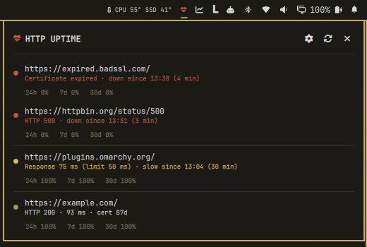
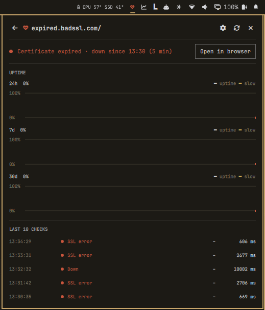
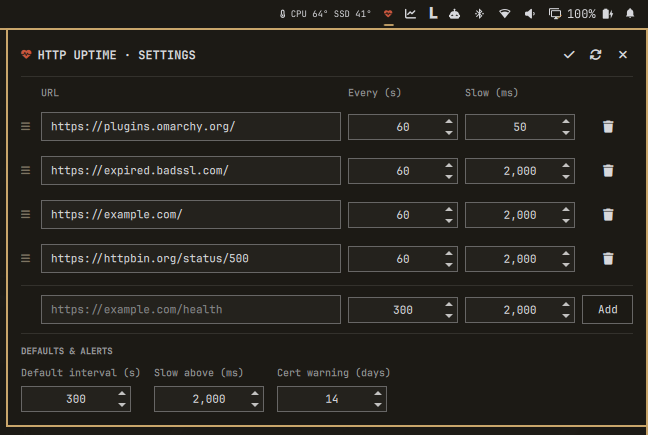

# HTTP Uptime

An Omarchy bar widget that monitors your URLs: 2xx responses, valid SSL certificates, response times and uptime over the last 24 hours, 7 days and 30 days.



## Features

- **Status at a glance.** The bar icon turns red when a URL is down or has an SSL error, and yellow when a URL is slow or its certificate expires soon. Hover it for a summary of every URL.
- **Checks.** A URL is up when it answers with a 2xx status (redirects are followed) and a valid certificate: chain, hostname and expiry are all verified. Requests time out after 10 seconds.
- **Slow responses.** Set a response-time limit globally or per URL.
- **Certificate expiry warnings** a configurable number of days ahead.
- **Notifications** when a URL gets worse than its previous check (down, SSL error, slow, certificate expiring) and when it recovers. Clicking a notification opens that URL's details.
- **Panel** grouped by severity: down first, then slow, then healthy. It shows when the current outage or slow streak began.
- **Detail view** per URL, with uptime and slow-response charts for 24h, 7d and 30d, and the last 10 checks with status, HTTP code and response time.
- **Settings in the panel.** Add, edit, reorder (drag and drop) and remove URLs, and set the check interval and slow limit per URL.

## Screenshots

| Panel | Detail view | Settings |
|---|---|---|
|  |  |  |

## Install

```sh
omarchy plugin add https://github.com/ExeQue/omarchy-http-uptime --enable
```

## Uninstall

```sh
omarchy plugin remove exeque.omarchy-http-uptime
```

This removes the plugin and its bar widget. Your settings and history are kept in case you reinstall. To delete them too:

```sh
rm -f ~/.config/omarchy/http-uptime.json
rm -rf ~/.local/state/omarchy/http-uptime
```

## Usage

| Action | Result |
|---|---|
| Left-click the icon | Open the panel |
| Right-click the icon | Check every URL now |
| Click a URL in the panel | Open its detail view |
| Gear icon in the panel | Settings: add, edit, reorder and remove URLs |

In settings, a row with unsaved changes shows ✓ (save) and ↺ (revert) in place of the trash icon. Enter in the URL field also saves the row. Unsaved changes are discarded when you leave settings.

## Configuration

Settings are stored in `~/.config/omarchy/http-uptime.json`, which the panel reads and writes. You can also edit the file by hand; changes apply on save.

```json
{
  "interval": 300,
  "warnDays": 14,
  "slowMs": 2000,
  "targets": [
    { "url": "https://example.com/" },
    { "url": "https://api.example.com/health", "interval": 60, "slowMs": 500 }
  ]
}
```

| Key | Meaning |
|---|---|
| `interval` | Default seconds between checks (minimum 10) |
| `warnDays` | Warn when a certificate expires within this many days |
| `slowMs` | Default response time, in milliseconds, above which a URL counts as slow |
| `targets[].interval`, `targets[].slowMs` | Per-URL overrides |

## Where data is stored

Everything stays on your machine.

| What | Location |
|---|---|
| Settings and monitored URLs | `~/.config/omarchy/http-uptime.json` |
| Check history | `~/.local/state/omarchy/http-uptime/<url>-<hash>.tsv` (under `$XDG_STATE_HOME` when that is set) |
| Plugin code | `~/.config/omarchy/plugins/exeque.omarchy-http-uptime/` |

Each history file holds one URL, with one line per check: epoch, up (0/1), status, HTTP code and response time in milliseconds. The file name is a readable form of the URL plus a short hash. Lines older than 30 days are pruned, and a URL's file is deleted when you remove or rename that URL. Delete the directory to reset all history.

## Privacy

- The plugin sends requests only to the URLs you add. It makes an HTTPS request with `curl`, and an `openssl` connection to read certificate expiry.
- There are no services, no background daemons outside the shell, and no privilege escalation.

## Dependencies

`bash`, `curl`, `openssl`, `awk`, `md5sum` and `omarchy-notification-send`, all present on a standard Omarchy install.

## Notes

- There is one widget per monitor. Only the first widget runs checks and sends notifications, and it shares the results with the others.
- Uptime is the share of checks that were up in each window, so a short outage between two checks can go unnoticed. Use a shorter interval for URLs where that matters.
- Revoked certificates are not detected, because `curl` does not check revocation.

## License

MIT
